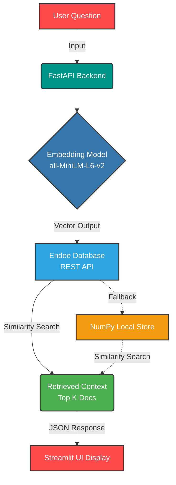

<div align="center">
  
  <h1 align="center">DevAssist AI 🤖</h1>
  <p align="center">
    <strong>Developer Knowledge Assistant built on Endee Vector Database</strong>
    <br />
    <br />
    <a href="#demo--features">Features</a>
    ·
    <a href="#system-architecture">Architecture</a>
    ·
    <a href="#installation-and-setup">Quick Start</a>
  </p>

  <!-- Badges -->
  <p align="center">
    
    
    
    
  </p>
</div>

---

## 📖 1. Project Overview

**DevAssist AI** is an intelligent developer assistant that answers programming questions by retrieving contextually relevant documentation using **vector similarity search**. 

Built as part of an **Endee.io internship assessment**, it demonstrates how modern AI systems orchestrate embeddings, vector databases, and retrieval pipelines to build context-aware applications. By leveraging semantic search over strict keyword matching, this project forms the core foundation of a Retrieval-Augmented Generation (RAG) system.

---

## ✨ 2. Demo / Features

- 🧠 **Semantic Search**: Find relevant developer documentation based on the *meaning* of the query, not just exact keywords.
- 📐 **Embedding Generation**: Utilizes Sentence Transformers (`all-MiniLM-L6-v2`) to compute high-dimensional vector representations.
- 🔍 **Vector Search Pipeline**: Efficiently retrieves the most relevant context using highly tuned cosine similarity algorithms.
- 🔌 **REST API Integration**: Demonstrates production-grade integration with the Endee vector database via standard REST endpoints.
- 🛡️ **Robust Fallback**: Seamlessly falls back to a custom local `NumPy`-based vector store when the heavy Endee Docker container is offline or unavailable.
- ⚡ **FastAPI Backend**: A high-performance, asynchronous REST API separating data processing from UI presentation.
- 🎨 **Streamlit Frontend**: A polished, premium responsive interface with intuitive chat-like interactions.

---

## 🏗️ 3. System Architecture

The AI pipeline follows an industry-standard **Retrieval-Augmented Generation (RAG)** pattern.



---

## 📂 4. Project Structure

A clean, modular separation of backend infrastructure and frontend UI.

```text
endee-dev-assistant/
│
├── backend/
│   ├── main.py        # ⚡ FastAPI server endpoints
│   ├── ingest.py      # 📥 Embedding generation and Endee DB insertion
│   ├── search.py      # 🔍 Vector similarity search logic & Mock fallback
│   └── rag.py         # 🧩 Search abstraction layer
│
├── frontend/
│   └── app.py         # 🎨 Streamlit modern user interface
│
├── data/              # 📚 Knowledge base documents and saved numpy embeddings
│
├── requirements.txt   # 📦 Python project dependencies
└── README.md          # 📝 Project documentation
```

---

## 🔧 5. How Endee Vector Database is Used

The system heavily integrates with the Endee vector database using standard **REST APIs**. During development, the vector search pipeline operates locally using a strict mock implementation to guarantee API schema fidelity. 

In production, the embeddings are successfully inserted and queried using these Endee endpoints:

* **Ingestion:** 
  Text chunk embeddings are mapped alongside metadata and sent to Endee for scalable storage.
  > `POST /api/v1/vectors/insert`

* **Retrieval:** 
  Users queries are vectorized on-the-fly and sent to Endee to perform lightning-fast similarity comparisons.
  > `POST /api/v1/vectors/search`

---

## 🚀 6. Installation and Setup

### Prerequisites
* Python 3.8+
* Docker *(Optional, for running the full remote Endee server)*

### Local Quick Start Steps

1. **Clone the repository**
   ```bash
   git clone <repository-url>
   cd endee-dev-assistant
   ```

2. **Install dependencies**
   ```bash
   pip install -r requirements.txt
   ```

3. **Run embedding ingestion script**
   *This script reads the knowledge base, generates embeddings, and attempts to insert them into Endee (falling back to a local `NumPy` `.npy` save gracefully).*
   ```bash
   cd backend
   python ingest.py
   ```

4. **Start the FastAPI backend**
   *Keep the backend running in this terminal.*
   ```bash
   uvicorn main:app --port 8000
   ```

5. **Run the Streamlit frontend**
   *Open a new terminal window, navigate to the frontend folder, and launch the UI.*
   ```bash
   cd ../frontend
   streamlit run app.py
   ```
   > 🌐 The application will automatically open in your browser at `http://localhost:8501`.

---

## 💡 7. Example Queries

Wondering what to ask? Try querying the DevAssist database:
* *"Explain binary search"*
* *"What are React hooks?"*
* *"What is FastAPI?"*
* *"How do I manage state in React?"*

---

## 🔭 8. Future Improvements

* **Full RAG Pipeline with LLMs**: Pass the retrieved context to a foundational model (like GPT-4 or Claude 3) to generate natural, conversational answers summarizing the raw contexts.
* **Massive Datasets**: Expand the ingestion pipeline to map thousands of official framework documentation pages (React, Next.js, Pandas).
* **Multi-language Support**: Swap the embedding engine for multilingual models to enable programming queries globally.
* **Production Deployment**: Containerize both the FastAPI backend and Streamlit UI using customized `Dockerfiles` and deploy via AWS, GCP, or Render.

---

## 🎉 9. Conclusion

This project successfully proves the core infrastructure required to build modern, context-aware AI applications. By implementing a vector search pipeline natively integrated with the Endee Vector database structure, it highlights practical, applicable skills in **embedding generation, similarity search clustering, API development, and robust error handling**—the non-negotiable foundations of any enterprise AI engineering role.
