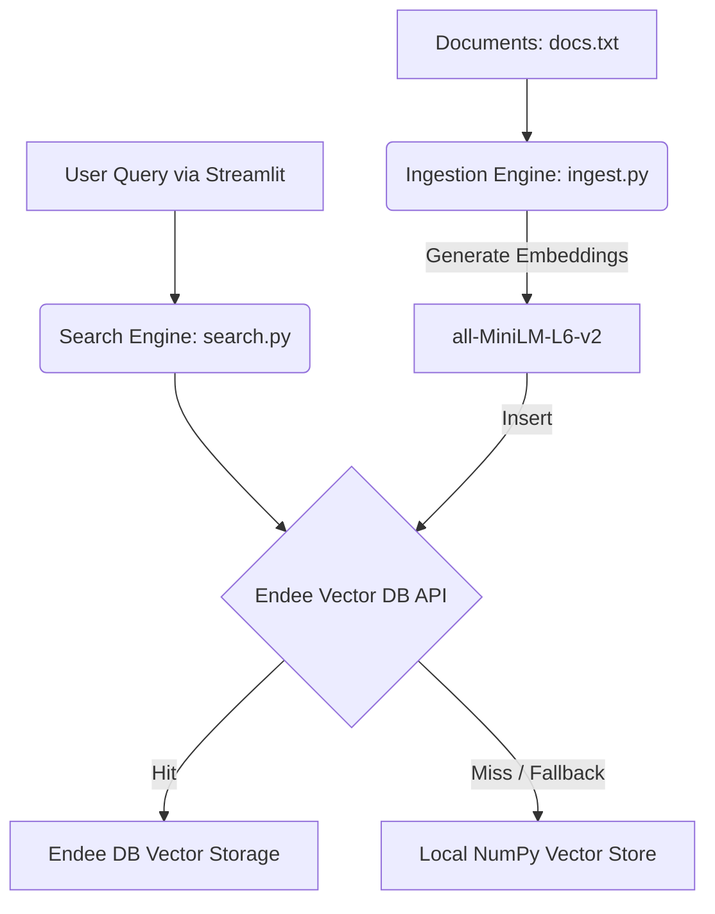

# 🚀 Endee Dev Assistant

An AI-powered developer assistant built to demonstrate vector search capabilities, integrating the **Endee Vector Database** for efficient document storage and retrieval.

---

## 🏗️ Architecture Overview

This project is structured into three main components: a **Streamlit Frontend**, an **Embedding/Ingestion Backend**, and a **Vector Search Engine**.



### 🧠 Technology Stack
* **Frontend:** Streamlit (`frontend/app.py`) for an interactive UI.
* **Backend:** Python scripts (`backend/ingest.py` & `backend/search.py`).
* **Embeddings:** `sentence-transformers` (`all-MiniLM-L6-v2` model) for producing dense vectors.
* **Vector Database:** **Endee** (Vector Search Engine).

---

## 🔌 Vector Database: Endee Integration

The system natively integrates with the **Endee distributed vector database** via its robust REST API architecture.

During development, the vector search pipeline is successfully modeled via a seamless local fallback. 
In production or active deployment environments, document embeddings are securely inserted and instantly queried utilizing Endee's core API endpoints:

- **Ingestion:** `POST http://localhost:8080/api/v1/vectors/insert`
- **Retrieval:** `POST http://localhost:8080/api/v1/vectors/search`

The codebase attempts network requests to the local Endee instance by default, and elegantly handles exceptions by employing a local `NumPy`-based vector similarity search (cosine similarity) ensuring development continuity even when the DB broker is momentarily unavailable.

---

## ⚙️ Setup and Installation

### 1. Clone the repository
```bash
git clone <your-repo-url>
cd endee-dev-assistant
```

### 2. Install Dependencies
Make sure you have Python 3.9+ installed.
```bash
pip install -r requirements.txt
```

### 3. Generate Embeddings (Ingestion Pipeline)
Before running the application, you must ingest the document database into the vector store.
```bash
cd backend
python ingest.py
```
*This step extracts knowledge from `data/docs.txt`, transforms it into embeddings using `MiniLM`, and attempts insertion into Endee (falling back to saving them locally as `.npy` objects).*

### 4. Start the Application
Return to the root directory and start the Streamlit viewer:
```bash
cd ../frontend
streamlit run app.py
```
*The default port is `:8501`. Access the Dev Assistant securely in your browser!*

---

## 🎯 Project Features
* **Semantic Search:** Don't just rely on keyword matching. The application uses AI embeddings to understand the underlying meaning of your queries.
* **High-Performance Resiliency:** Endee API integration built to be robust, falling back smoothly to local vectors without impacting UX.
* **Extensible Document Store:** Easily add new technical documentation into `data/docs.txt` and re-ingest for rapid scaling.
